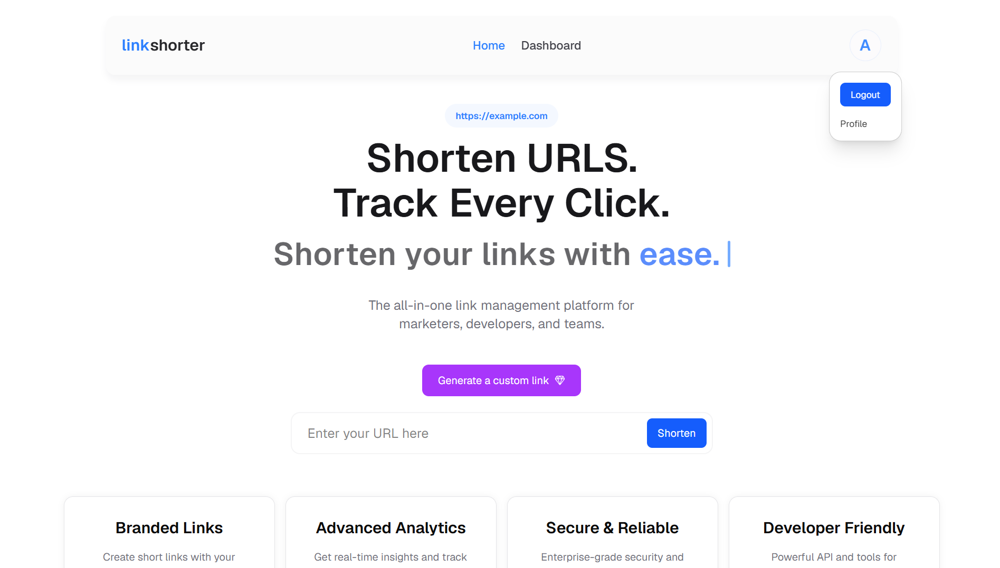
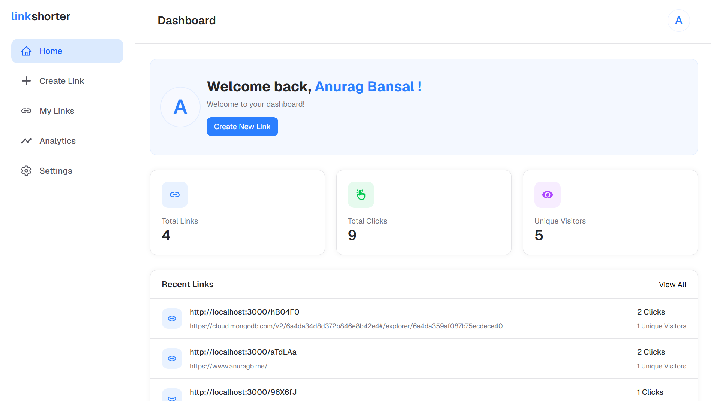
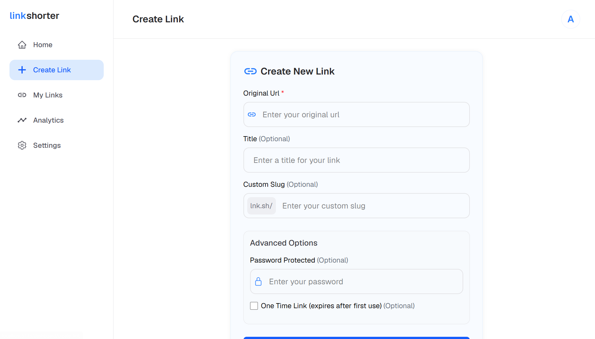
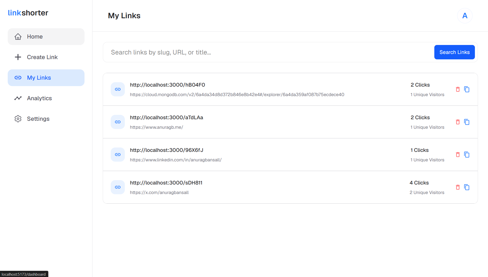
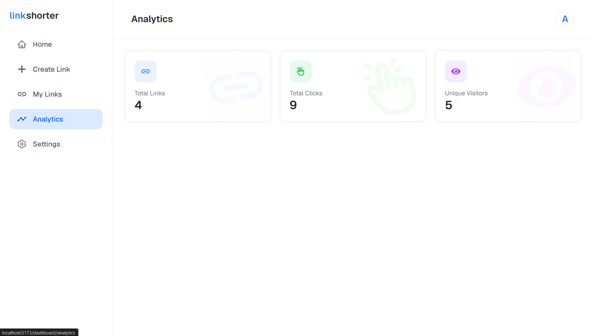
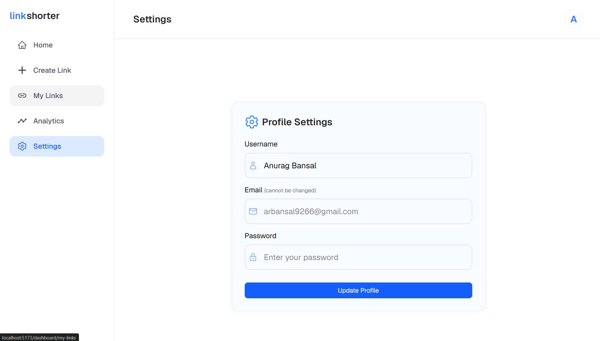

# LinkShortner

<p align="center">
    
</p>

LinkShortner is a full-stack URL shortener with a public landing page, user authentication, a protected dashboard, link management, and click analytics. It is built as a two-part app:

- `frontend/` - a React + Vite SPA for the landing page, auth screens, and dashboard
- `backend/` - an Express + MongoDB API that handles auth, link storage, redirects, and analytics

Frontend URL: https://github.com/anuragbansall/

## What it does

- Shorten long URLs into shareable links
- Create custom slugs for cleaner links
- Protect links with a password
- Create one-time-use links
- Track total clicks and unique visitors
- View and manage links from a private dashboard
- Update your profile settings from the app

## Demo

### Video Walkthrough

[Watch the demo video](media/Demo.mp4)

### Landing Page



### Dashboard











## Tech Stack

### Frontend

- React 19
- Vite
- React Router
- TanStack Query
- Tailwind CSS v4
- Axios
- React Toastify

### Backend

- Node.js
- Express 5
- MongoDB with Mongoose
- JSON Web Tokens
- bcryptjs
- cookie-parser
- cors
- nanoid

## Features

### Public Site

- Clean landing page with a hero section and feature cards
- Quick link-shortening entry point from the homepage
- Responsive header and mobile drawer navigation

### Authentication

- Register and login flows
- Cookie-based auth with protected routes
- Profile-aware header and dashboard state

### Dashboard

- Overview cards for total links, total clicks, and unique visitors
- Recent links list with original URL, short URL, and click stats
- Link creation form with title, custom slug, password protection, and one-time-use options
- Link management pages for browsing and updating your saved links
- Analytics page for performance tracking
- Settings page for updating profile details

### Redirect and Tracking Flow

- Redirects short links to the original destination
- Records visitor information for analytics
- Increments total and unique click counts
- Handles password-protected and one-time-use links

## Project Structure

```text
Link-Shorter/
├── backend/
│   ├── index.js
│   └── src/
│       ├── config/
│       ├── controllers/
│       ├── middleware/
│       ├── models/
│       ├── routes/
│       └── utils/
├── frontend/
│   ├── src/
│   │   ├── Components/
│   │   ├── Pages/
│   │   ├── api/
│   │   ├── hooks/
│   │   └── utils/
│   └── public/
└── media/
    ├── HomeDemo.png
    ├── DashboardHomeDemo.png
    ├── DashboardCreateLinkDemo.png
    ├── DashboardMyLinksDemo.png
    ├── DashboardAnalyticsDemo.png
    ├── DashbaordSettingsDemo.png
    └── Demo.mp4
```

## Setup

### Prerequisites

- Node.js 18 or newer
- MongoDB connection string

### 1. Clone the repo

```bash
git clone <your-repo-url>
cd Link-Shorter
```

### 2. Configure the backend

Create a `.env` file inside `backend/`:

```env
PORT=3000
MONGO_URI=your_mongodb_connection_string
JWT_SECRET=your_jwt_secret
FRONTEND_URL=http://localhost:5173
```

### 3. Configure the frontend

Create a `.env` file inside `frontend/`:

```env
VITE_BACKEND_URL=http://localhost:3000/api
```

### 4. Install dependencies

Open two terminals and run:

```bash
cd backend
npm install
```

```bash
cd frontend
npm install
```

### 5. Run the app

Start the backend:

```bash
cd backend
npm run dev
```

Start the frontend:

```bash
cd frontend
npm run dev
```

## API Overview

### Auth and user routes

- `POST /api/users/register`
- `POST /api/users/login`
- `POST /api/users/logout`
- `GET /api/users/profile`
- `PUT /api/users/profile`
- `DELETE /api/users/profile`

### Link routes

- `POST /api/links`
- `GET /api/links`
- `GET /api/links/:id`
- `PUT /api/links/:id`
- `DELETE /api/links/:id`

### Analytics routes

- `GET /api/analytics`
- `GET /api/analytics/:linkId`

### Redirect route

- `GET /:slug`

## Notes

- The frontend uses React Query for server state and auth caching.
- Logout clears the cached user state so protected UI updates immediately.
- The root redirect route is responsible for click tracking before sending users to the original URL.
